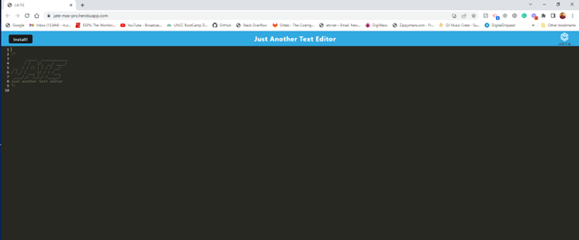
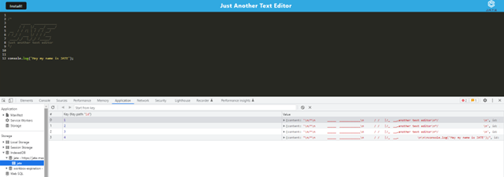
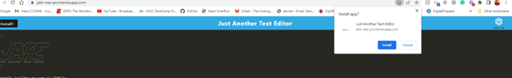
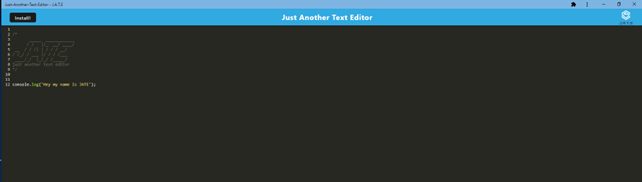

# JATE (Just Another Text Editor) 

## Description
  Just Another Text Editor, aka J.A.T.E, is a PWA (Progressive Web Application) that is a single page application. A web based text-editor that can also be used offline or installed to the device. The application is utilizes, Webpack plugins , IndexedDB, Manifest.json for installability , Service Workers for offline usage and cache, next-gen JavaScript/bundles, and Heroku for deployment. 
  

 

## Table of Contents 
  * [Installation](#installation)
  * [Usage](#usage)
  * [Important-Links](#Important-Links)
  * [Questions](#questions)

  ## Installation
  * Ensure you are in your root folder,then open terminal and clone code from github. Then run these in the command terminal:

  * Next, run "npm i" to install packages 
  * IndexedDB - "npm i idb" > 
  * Create Heroku Account > in Terminal "heroku create" > git add, git commit, git push heroku 'branch name':main
  

   ## Usage 
  
  * Firstly, open the terminal 
  * To acitvate the application start your sever with "npm start"
  * Then to run the application in web Browser use: http://localhost:3000/
  * IF you want to start it in Heroku, start the server then navigate to https://jate-max-pro.herokuapp.com/com/
 

   

   
 
   
 
   

 ## Important Links 
* GitHub Link: https://github.com/MichaelZimm20/jate-text-editor

* Heroku Link: https://jate-max-pro.herokuapp.com/

## Questions 
  If you have any questions or concerns, contact:
  * GitHub: [MichaelZimm20](https://github.com/MichaelZimm20)